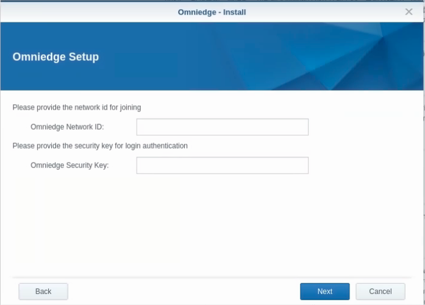

# omniedge-synology

Synology package for Omniedge based on pre-compiled binary.

## Release Notes

|Version|Release Date|Notes|
|--|--|--|
|0.2.3.1|July, 12, 2022|Add configuration wizard during installation|
|0.2.3|April, 25, 2022|Add refresh token|
|0.2.2|February, 27,2022|Fix machine ID error|
|0.2.1|January, 15, 2022|Integrated with new backend|
|0.2.0 |August,2, 2021|Initial release , new backend API,Optimize workflow,Fix incorrect device mac block the OmniEdge start|
|0.1.0|Apr 8, 2021|Initial release|

## How to use 

1. Sign up your account
2. Generate **Security-key** and get the **Virtual Network ID** from [Dashboard](https://omniedge.io/dashboard)
3. Download and install OmniEdge Synology
4. Fill **Security-key** and **Network ID** during the installation wizard
5. Install for DSM7 `sudo sed -i 's/package/root/g' /var/packages/omniedge/conf/privilege`

