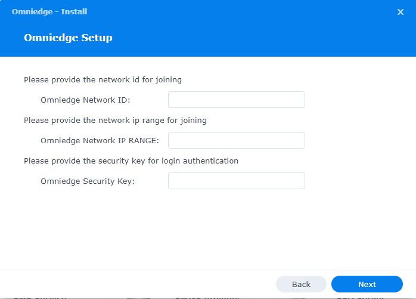

# omniedge-synology

Synology package for Omniedge based on pre-compiled binary.

## Release Notes

|Version|Release Date|Notes|
|--|--|--|
|2.8.7|February 11, 2026|Automated CLI upgrade|
|2.8.6|February 11, 2026|Automated CLI upgrade|
|2.8.6|February 11, 2026|Automated CLI upgrade|
|2.8.5|February 11, 2026|Automated CLI upgrade|
|2.8.5|February 11, 2026|Automated CLI upgrade|
|2.8.4|February 11, 2026|Automated CLI upgrade|
|2.8.4|February 11, 2026|Automated CLI upgrade|
|2.8.3|February 11, 2026|Automated CLI upgrade|
|2.8.2|February 10, 2026|Automated CLI upgrade|
|2.8.1|February 09, 2026|Automated CLI upgrade|
|2.7.9|February 09, 2026|Automated CLI upgrade|
|2.7.7|February 09, 2026|Automated CLI upgrade|
|2.7.6|February 09, 2026|Automated CLI upgrade|
|2.7.4|February 09, 2026|Automated CLI upgrade|
|2.7.3|February 09, 2026|Automated CLI upgrade|
|2.7.2|February 09, 2026|Automated CLI upgrade|
|2.7.1|February 08, 2026|Automated CLI upgrade|
|2.7.0|February 06, 2026|Automated CLI upgrade|
|2.7.0-pre|February 06, 2026|Automated CLI upgrade|
|2.6.0|February 06, 2026|Automated CLI upgrade|
|2.3.0|February 04, 2026|Automated CLI upgrade|
|2.3.0|February 04, 2026|Automated CLI upgrade|
|2.2.3|February 03, 2026|Automated CLI upgrade|
|2.2.2|February 01, 2026|Automated CLI upgrade|
|2.2.1|February 01, 2026|Automated CLI upgrade|
|2.1.0|January 31, 2026|Automated CLI upgrade|
|2.0.0|January 31, 2026|Automated CLI upgrade|
|1.0.2-beta.0|January 12, 2026|Automated CLI upgrade|
|1.0.1|January 09, 2026|Automated CLI upgrade|
|1.0.1|January 09, 2026|Automated CLI upgrade|
|1.0.1|January 09, 2026|Automated CLI upgrade|
|0.3.0|January 06, 2026|Automated CLI upgrade|
|0.2.3.1|July, 12, 2022|Add configuration wizard during installation|
|0.2.3|April, 25, 2022|Add refresh token|
|0.2.2|February, 27,2022|Fix machine ID error|
|0.2.1|January, 15, 2022|Integrated with new backend|
|0.2.0 |August,2, 2021|Initial release , new backend API,Optimize workflow,Fix incorrect device mac block the OmniEdge start|
|0.1.0|Apr 8, 2021|Initial release|

## How to use 

1. Sign up your account
2. Generate **Security-key**,  get the **Virtual Network ID** and **IP Range** from [Dashboard](https://connect.omniedge.io/dashboard)
3. Download and install OmniEdge Synology
4. Fill **Security-key** , **Network ID**  and **IP Range** during the installation wizard
5. Install for DSM7 `sudo sed -i 's/package/root/g' /var/packages/omniedge/conf/privilege`

